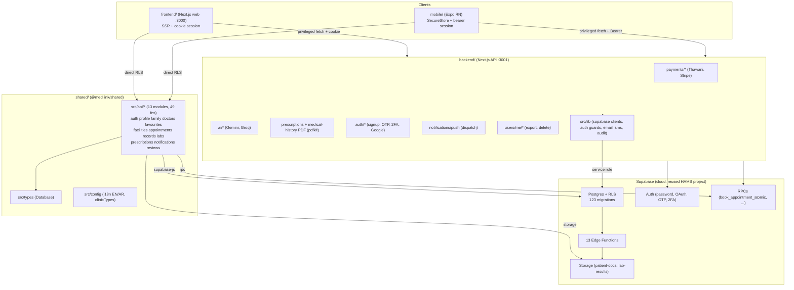
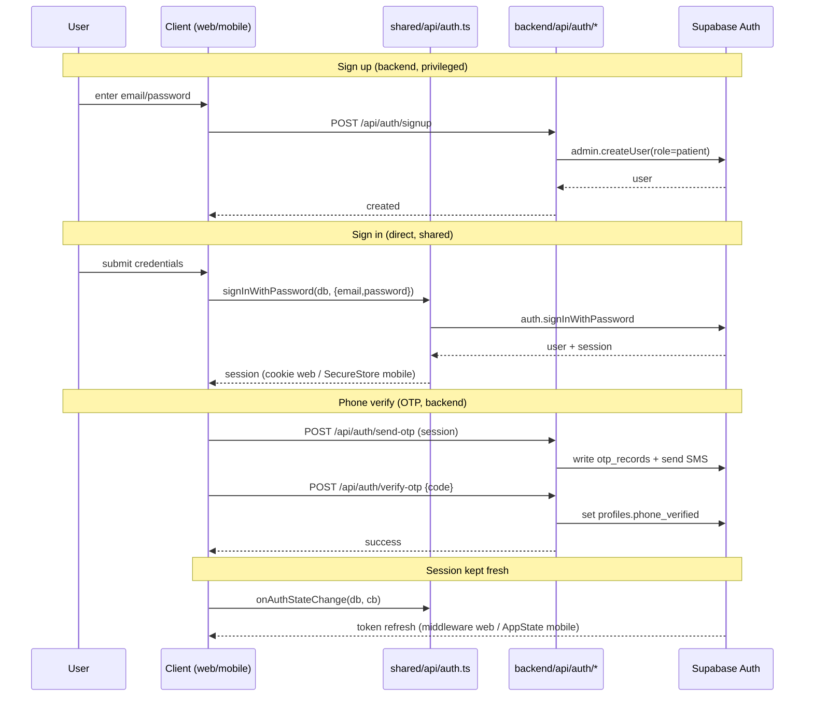
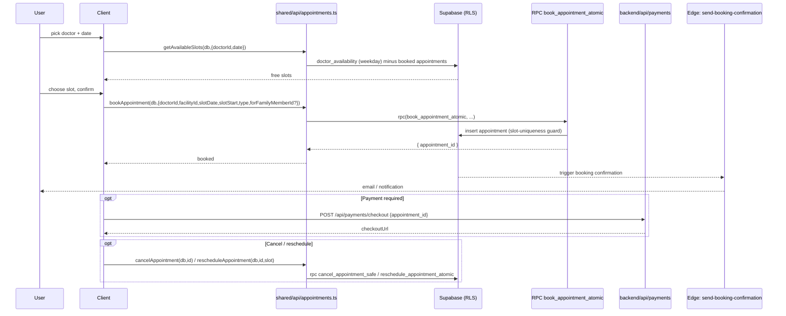
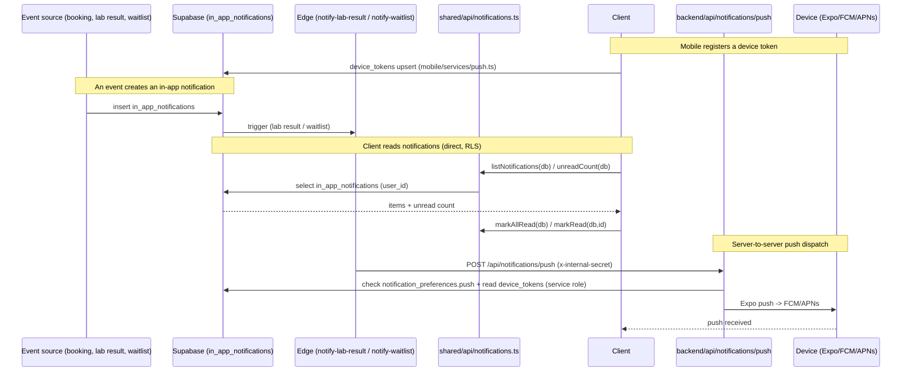
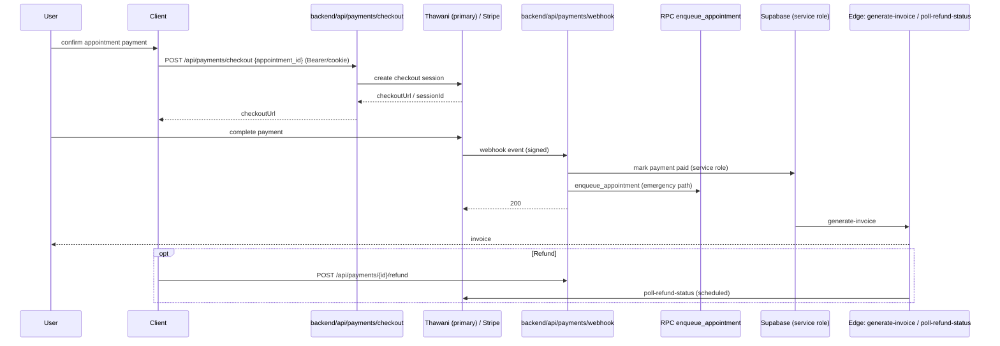
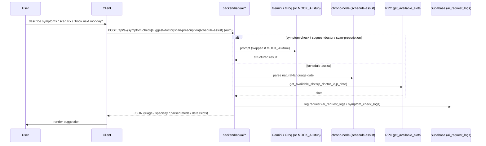

# MediLink — Architecture Diagrams

Mermaid diagrams of the real system. Renders on GitHub and in Mermaid-aware viewers. Every node maps to an actual workspace, module, route, or RPC.

## 1. Monorepo architecture

## 2. Authentication flow

## 3. Appointment booking flow

## 4. Notification flow

## 5. Payment flow

## 6. AI service flow

> Note: `MOCK_AI=true` short-circuits the LLM calls with deterministic stubs for keyless local development (see [RUNBOOK.md](./RUNBOOK.md) §2 and [TESTING_GUIDE.md](./TESTING_GUIDE.md) §6).
